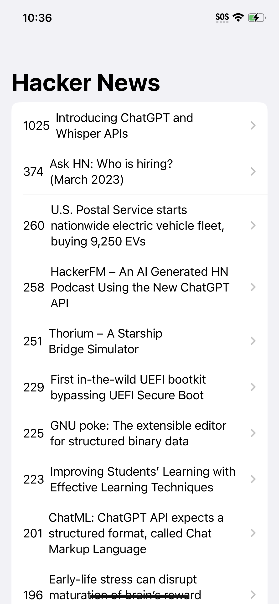

# HackerNews

## What is Flash Chat

HackerNews is an iOS application to showcase top trending Hacker News website articles. Hacker News website is a social news website focusing on computer science and entrepreneurship. It is run by the investment fund and startup incubator Y Combinator.

I have built this application using Swift, SwitUI, WebKit and Algolia API calls.

## Important Steps

* Integrate WebKit with SwiftUI.
* Fetch data from Algolia API provider.
* Create a WebView
* Establish a Network Manager.
* Setup navigation using navigation link.
* Embed List View to display list latest articles.

## Screens

### Hacker News Screen

### Article Screen

